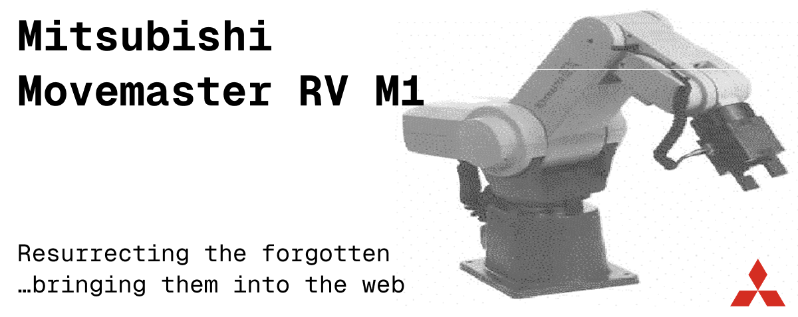
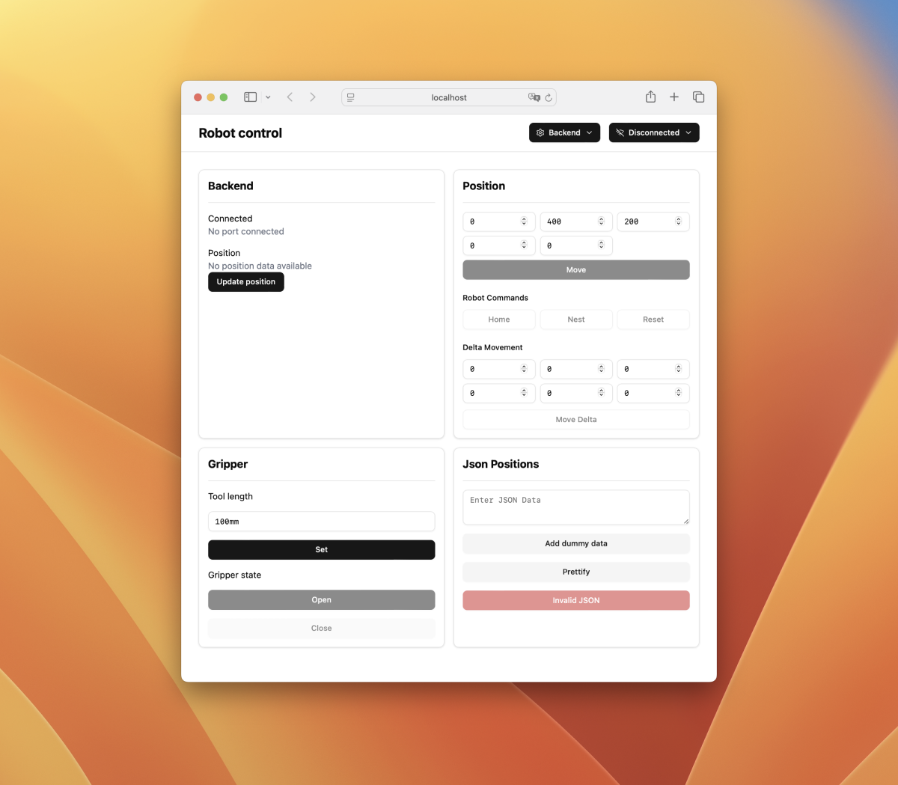

# movemaster-js



A standalone web application to control a "vintage" Mitsubishi Movemaster EX Robot via USB. This project provides an intuitive web interface for operating the robot, built with a React frontend and Node.js backend.

> This project relies heavily on the great work by Daniel Springwald – all documented [here](https://github.com/Springwald/Movemaster-RV-M1-Library).

## Features

- Web-based control interface for Mitsubishi Movemaster EX Robot
- Real-time robot status monitoring
- Position control and gripper operations
- Serial port management
- JSON-based path movement



## Getting Started

### Prerequisites

- NodeJS runtime
- USB connection to Mitsubishi Movemaster EX Robot via RS232 adapter

### Quick Setup

1. **Clone the repository**
   ```bash
   git clone https://github.com/max-hans/movemaster-js.git
   cd movemaster-js
   ```

2. **Run the setup script**
   ```bash
   ./setup.sh
   ```
   This will automatically install all dependencies, build and deploy the frontend, and start the application.

3. **Access the application**
   Open your browser and navigate to `http://localhost:5123`

### Manual Setup

If you prefer to run the steps manually:

1. **Clone the repository**
   ```bash
   git clone https://github.com/max-hans/movemaster-js.git
   cd movemaster-js
   ```

2. **Install dependencies**
   ```bash
   # Install frontend dependencies
   cd frontend
   npm install
   
   # Install backend dependencies
   cd ../backend
   npm install
   ```

3. **Build and deploy the frontend**
   ```bash
   cd frontend
   npm run deploy
   ```
   This will build the React frontend and automatically place it in the backend's public folder.

4. **Start the backend server**
   ```bash
   cd backend
   npm run start
   ```

5. **Access the application**
   Open your browser and navigate to the server address (`http://localhost:5123`)

The web interface should pop up, and you can start controlling your Movemaster robot through the browser.

## Development

For development with hot reload:

- Frontend: `cd frontend && npm run dev`
- Backend: `cd backend && npm run start` (already includes watch mode)

## Library

This application is built on top of the [movemaster-robot](https://www.npmjs.com/package/movemaster-robot) library. If you want to build your own custom applications, you can use that standalone module directly.
